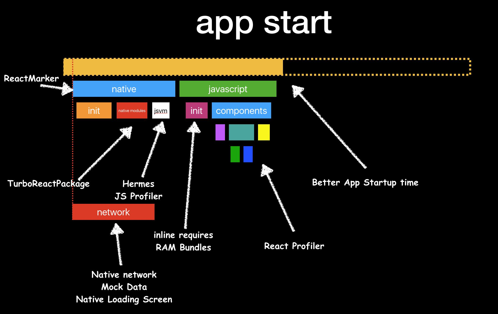
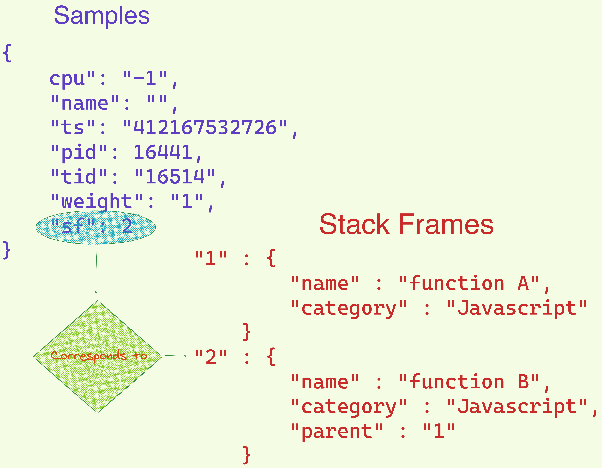
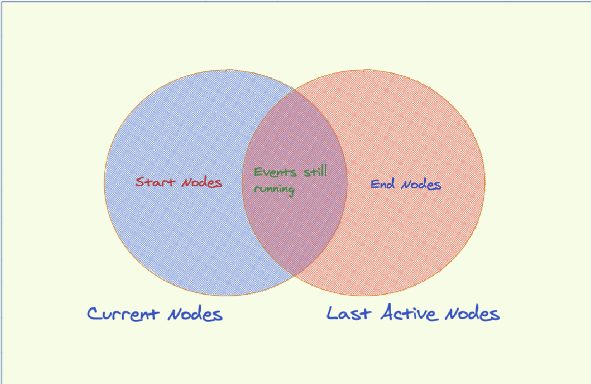
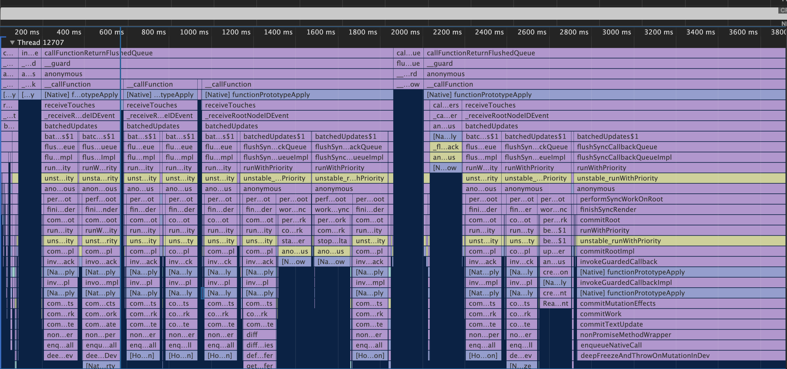
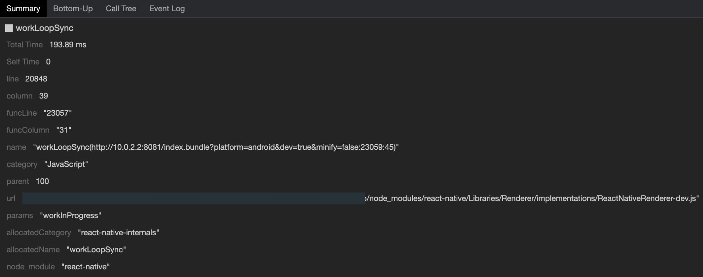

# React-native-perf

## What is Hermes?

Hermes is an open sourced JavaScript engine which is optimised to run React Native applications on Android. It was announced by Facebook at the keynote at [Chain React 2019](https://www.youtube.com/watch?v=zEjqDWqeDdg&list=PLE7tQUdRKcyYA_l4Vo-OQi6yyxtTmw1OS&index=2&t=0s&ab_channel=InfiniteRed) Hermes has several advantages over other engines in areas like start up times, memory usage and app size.

The use of Hermes in React Native applications is optional at this time, however, considering that it has been explicitly designed by Facebook for React Native, it is bound to be the preferrable mode of running React Native applications in the future.

For more information on Hermes and how to use it, you can head over to its [documentation](https://reactnative.dev/docs/hermes).

The Hermes engine helps bolster the performance of the React Native application in an mobile environment as observed by the experiments performed by [Mr. N. Parashuram](https://twitter.com/nparashuram) and demonstrated at Chain React 2019, where the Hermes engine was unvieled. He demos certain live applications namely the Chain React Conference application as well as another React Native application callled Mattermost and profiles them while running with and without Hermes. The gains in speed and performance were seen clearly in the experiements and this served as a great introduction of Hermes in the React Native ecosystem as a powerhouse.



For more information on this, please read [this article](http:**//blog.nparashuram.com/2019/07/facebook**-announced-hermes-new.html).

## Trace Events formats

React Native applications running on Hermes have a mechanism in place to profile the application as it runs. The process to do so is relatively simple. The developer menu of RN applications running on Hermes has an option to toggle profiling. Upon enabling profiling, the profiler starts to create trace events (in the form of samples and stack frames) which can be used to obtain timing information of the functions running.

However, the trace events created by the Hermes profiler are of the JSON Object format as opposed to the Chrome supported JSON Array Format. There is hence a need for a [transformer](https://www.npmjs.com/package/hermes-profile-transformer) that converts the Hermes profile into JSON Array format which is supported by Chrome DevTools.

### Understanding trace events

Trace events are data points that determine the state of an app at any point of time. These data points include names of the functions running, their process and thread IDs among many others. The most common sampling profiles are usually compliant to the JSON format and can be in 2 formats, namely -

1. JSON Array format - JSON Array format is the simplest format, it simply has an array of event objects which indicate the start and end times (based on **phases**) and can be loaded into Chrome DevTools to visualise the performance of an application.
   Eg:
   ```ts
   [
   	{ name: "Asub", cat: "PERF", ph: "B", pid: 22630, tid: 22630, ts: 829 },
   	{ name: "Asub", cat: "PERF", ph: "E", pid: 22630, tid: 22630, ts: 833 },
   ];
   ```
   The JSON array format is possibly the simplest and most effective way to store the profiling information of an application. It is easy to read and hence is widely adopted.
2. JSON Object format - JSON Object format, as its name suggests, is a collection of key-value pairs that can be used to capture the state of the application.
   Eg:

```ts
  {
    "traceEvents": [
      {"name": "Asub", "cat": "PERF", "ph": "B", "pid": 22630, "tid": 22630, "ts": 829},
      {"name": "Asub", "cat": "PERF", "ph": "E", "pid": 22630, "tid": 22630, "ts": 833}
    ],
    "displayTimeUnit": "ns",
    "systemTraceEvents": "SystemTraceData",
    "otherData": {
      "version": "My Application v1.0"
    },
    "stackFrames": {...}
    "samples": [...],
  }
```

The `object` contains of 3 keys namely, `traceEvents`, `samples` and `stackFrames`, each of these are extremely important to analyse the performance of the application. The benefit of this structure over the JSON Array Format is that the information is stored in a more efficient format and additional data points can be added.

In the case of the Hermes profile, we get a JSON Object back, with metadata events in its `traceEvents` property and the `samples` and `stackFrames` properties capturing information about all the other functions running through the duration of the application. These propeties contain essential information such as event categories, phases and timestamps that help us obtain maximum information from the profile.

### Events and Phases

Events are actions that are triggered while an application is being run. These events can be in a variety of phases. The simplest type of event to understand is the Duration Event. As the name indicates, these events simply capture the duration of an action. Two distinct data points, namely the `start` and the `end` of a duration event can completely specify the status of these actions. These states are known as phases.

| SNo. | Event Type         | Phases                                                  |
| ---- | ------------------ | ------------------------------------------------------- |
| 1.   | Duration Events    | B(begin), E(end)                                        |
| 2.   | Complete Events    | X                                                       |
| 3.   | Instant Events     | I                                                       |
| 4.   | Counter Events     | C                                                       |
| 5.   | Async Events       | b(nestable start), n(nestable instant), e(nestable end) |
| 6.   | Flow Events        | s(start), t(step), f(end)                               |
| 7.   | Sample Events      | P                                                       |
| 8.   | Object Events      | N(created), O(snapshot), D(destroyed)                   |
| 9.   | Metadata Events    | M                                                       |
| 10.  | Memory Dump Events | V(global), v(process)                                   |
| 11.  | Mark Events        | R                                                       |
| 12.  | Clock sync Events  | c                                                       |
| 13.  | Context Events     | (,)                                                     |

For our particular usecase, the events are just function calls and different samples indicate when a function is pushed and popped from the call stack. The _phases_ of events are, hence, the most important properties for tracing events as they indicate the state of the functions in the call stack. For our usecase, we can assume that the Hermes profile consists of only Duration Events.

## Interpretation of different events in a profile

The Hermes profile is of the JSON Object Format, however, the `traceEvents` property does not contain timing information of functions as we expect. Instead the `traceEvents` property merely contains of metadata events, and the rest of the information is captured in the `samples` and `stackFrames` properties.

The `samples`, as the name suggests, consists of snapshots of the function call stack at specific timestamps. They also contain an `sf` property which corresponds to an element in the `stackFrames` property of the profile.



The events can also be categoried into broad categories based on their origin. Events usually written in source code fall under the category of **Javascript**, while the events exected natively on the platform are appropriately categoried as **Native**. **Metadata** is another primary category of events and are usually collected in the `traceEvents` property of the Hermes profile.

### Definitions

1. **Nodes** - Nodes stand for all the events possible in a function call stack. For eg:

   ```ts
   "2" : {
   "line": "8",
   "column": "12",
   "funcLine": "8",
   "funcColumn": "12",
   "name": "f1(test.js:8:12)",
   "category": "JavaScript",
   "parent": 1
   }
   ```

   Each of these stack frame objects can have corresponding begin and end events. The individual begin/end events can be referred to as nodes.

   Nodes only have context in particular timestamps, i.e. a node can be in `start`, `end` or `running` state at a particular timestamp

2. **Active and Last Active Nodes** - Building upon the previous definition, the active nodes at any particular time are the nodes that are active in the current timestamp. The Last active nodes similiarly stand for the nodes that were active in the preceding sampling time.
3. **Start and End Nodes** - We can define start nodes as **nodes active in current timestamp but absent in last active nodes**, while the end nodes can be defined as **nodes in last active nodes but absent in current active nodes**



The Hermes Profile transformer works by identifying start and end nodes at each timestamp and creating events from these nodes to be displayed on Chrome DevTools.

## Usage: Integrated into RN CLI

- Command:
  - Only works for DEV mode, since CLI interacts with adb to pull the profile from Android device
  - `npx react-native profile-hermes`, allows users to pull the converted device to their local machine
- Three categories - what each category represents and which parts of the code base should we be focusing on
  - Categories: Native, JS, node_modules
  - Which part to focus on: JS code (functions that are part of the program)
- Timestamp and duration of events
  - How to look at timestamp and duration of events, so that evaluate which function of the app takes the most time

### Insights from profiling information

The duration of a function call can be identified by from the timestamps of the corresponding start and end events. If this information is successfully captured, the events show up in horizontal bars.


As you may observe the functions can be seen in horizontal lines, and the time axis can help us determine how long a function runs.
The function calls can also be selected for extra details, for eg:

These summaries explicitly contain how long the function runs and we can also identify the line and column numbers by means of which we can also isolate parts of our code base that slows us down.

Sourcemaps add a lot of value here, as by default the line and column numbers are those indicated in bundle files, however upon using source maps we can map our function calls to regular "unbundled" files, improving debugging experience.

The categories of events help us determine the color of the function rows in the visualisation. We broadly have 2 types of categories namely,

1. Obtained from **source maps** - Sourcemaps can be optionally provided to augment the information provided by hermes. The sourcemaps help us identify better categories for events, hence adding value to our visualisation. These categories include two broad categories, namely:
   - `react-native-internals`
   - `node_modules`
2. Obtained from Hermes Samples - These categories are obtained by default and can be mapped to function calls. Categories `Javascript` and `Native` are predominantly seen, and in tandem with Source maps, this can help us differentiate from the boiler plate code written in node_modules and the actual code that we write.

## Bibliography

- [Using hermes](https://reactnative.dev/docs/hermes)
- [N Parashuram's blog on React Native performance with Hermes](http://blog.nparashuram.com/2019/07/facebook-announced-hermes-new.html)
